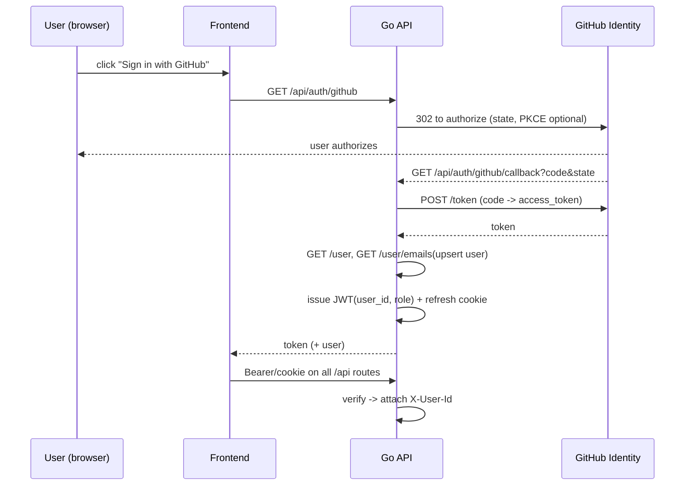

# Feature Request — User-Created Storymaps

> Status: **Design (decisions locked — not yet implemented)**
> Supersedes the build-time, import-time story registry as the source of *new*
> stories. Bundled stories keep working untouched; user stories are added at
> runtime through a Go REST API + SQLite + GitHub sign-on.

---

## 1. Goal

Today every story is a JSON file imported at **build time** in `src/stories.js`.
Adding a story means **editing that registry and rebuilding** `dist/`. This
feature lets an **authenticated user create a story in the running app**:

- Create a story: **title, subtitle, byline, and per-chapter media**
  (image / audio / video) plus a **Markdown description**.
- No rebuild: the story lives in a **database (SQLite)**, is served by a new
   **Go REST API**, and is rendered by the **existing** React story renderer.
- **GitHub single sign-on** to create and manage stories.
- Each user-set story is **private or public** (user's choice).
- Media per chapter is either an **external URL the user supplies**
   (S3 / object store / Google Drive / any absolute URL) **or** a file
   **uploaded to the server's local disk**.

---

## 2. Decisions (locked)

| # | Question | Decision |
|---|---|---|
| 1 | Sign on | **GitHub OAuth2 from day one** for normal users. **Local email/password is admin-only** (a few seeded service accounts, from env). No public self-registration. |
| 2 | Visibility | Per-story **`private` \| `public`**, chosen by the owner. |
| 3 | Media storage | **Local disk by default**; a chapter may instead reference an **external URL** (S3/object-store/Google Drive/…) the user provides. |
| 4 | Existing HTML stories | **Kept as-is, shipped embedded** (build-time imports). No migration. |
| 5 | Backend-stored stories | Descriptions are **Markdown** (rendered + sanitized). Embedded stories keep their **HTML** description (dual renderer). |
| 6 | Static fallback | Embedded stories still work with **no server**; user stories require the server origin. |

**Key insight:** the renderer (`App.jsx → StoryMap`) already accepts an arbitrary
story *object*. So the whole feature is: **feed story objects from a live API
instead of from imports**, add a **Markdown renderer with a HTML fallback**,
add **auth**, and build a **creator UI**. The map/scroll/render pipeline is
reused almost unchanged.

---

## 3. Current state (context)

```
src/stories.js         build-time registry: import each *.storymap.json
src/App.jsx            StoryPicker (static dropdown) + StoryMap per story
src/components/ChapterCard.jsx  renders image | video(posted) | waveform
                             + description via dangerouslySetInnerHTML (HTML)
scripts/convert-storymaps.mjs  build-time generator of new JSONs from collections
vite-plugin-singlefile dist/index.html is one self-contained file, openable via file://
```

**Limits being removed:** build-time registry + rebuild; HTML-only text; auth-less
media on disk. **Kept:** the renderer, the story JSON shape, embedded stories.

---

## 4. Data model (SQLite)

### 4.1 ERD

```mermaid
erDiagram
    USERS ||--o{ STORIES : owns
    USERS ||--o{ MEDIA_ASSETS : uploaded
    STORIES ||--o{ CHAPTERS : has
    CHAPTERS ||--o| MEDIA_ASSETS : uses_local
    STORIES ||--o| MEDIA_ASSETS : uses_local

    USERS {
        text id PK
        text github_login  "unique, from GitHub OAuth"
        text github_id     "unique numeric sub"
        text admin_email   "NON NULL only for admin accounts"
        text password_hash "NON NULL only for admin"
        text role          "user | admin"
        text display_name
        timestamptz created_at
    }
    STORIES {
        text id PK "slug or uuid"
        text user_id FK
        text title
        text subtitle
        text byline
        text footer_md "markdown, sanitized"
        text theme "dark|light"
        int show_markers
        text marker_color
        int inset
        text inset_position
        text inset_style
        json global_view
        text start_slide
        text end_slide
        text map_style
        text projection
        text visibility "private|public (owner choice)"
        text status "draft|published"
        timestamptz created_at
        timestamptz updated_at
    }
    CHAPTERS {
        text id PK "uuid"
        text story_id FK
        int position "render + scroll order"
        text title
        text description_md "MARKDOWN for user stories"
        text alignment "left|right|center|full"
        int hidden
        json location "{center,zoom,pitch,bearing}"
        text map_animation "flyTo|easeTo"
        int rotate_animation
        json on_chapter_enter
        json on_chapter_exit
        text media_type "none|image|audio|video"
        text media_ref_type "external|local|none"
        text media_external_url "S3/Drive/any absolute URL"
        text media_asset_id FK "if local upload"
        int auto_play_audio
        json source "credits block"
    }
    MEDIA_ASSETS {
        text id PK "uuid"
        text user_id FK
        text story_id FK null
        text chapter_id FK null
        text kind "image|audio|video"
        text orig_name
        text stored_path "random basename under MEDIA_DIR"
        text mime
        int bytes
        int width
        int height
        timestamptz uploaded_at
    }
```

### 4.2 Auth / users

| Column | Type | Notes |
|---|---|---|
| `id` | text PK | |
| `github_login` | text unique | nullable; set for GitHub accounts |
| `github_id` | text unique | GitHub numeric user id |
| `admin_email` | text | **NON-NULL only for admin** accounts (local creds) |
| `password_hash` | text | **bcrypt, only for admin** accounts |
| `role` | text | `user` \| `admin` |
| `display_name` | text | |
| `created_at` | timestamptz | |

- **GitHub user** row: `github_login`/`github_id` set, `admin_email`/
   `password_hash` NULL, `role=user`.
- **Admin** row: `admin_email` + `password_hash`, `role=admin`. Seeded from
   env (`ADMIN_EMAIL`, `ADMIN_PASSWORD`) at boot via an idempotent upsert. No
   public sign-up endpoint exists.

### 4.3 Story visibility

`visibility` = `private` \| `public`, default `private` on create, owner may
change it. List endpoints: unauthenticated → only `public`; authenticated →
owner's stories (both visibilities); admin → all.

---

## 5. Text: Markdown vs HTML (dual render)

- **Embedded stories** (bundled `*.storymap.json`, imported at build time): keep
   their **HTML** `description` and render via `dangerouslySetInnerHTML`
   **exactly as today**. No change, no migration.
- **User stories** (from the API): carry **`description_md`** (Markdown),
   rendered with `react-markdown` + `remark-gfm` + **`rehype-sanitize`**. The
   sanitizer is the XSS boundary (strips `script`, `on*` handlers,
   `javascript:` URLs) — this is *why* new content is Markdown, not raw HTML.
- **Front-end rule in `ChapterCard`:** if `chapter.description_md` is present
   → render sanitized Markdown; else fall back to legacy HTML `description`.
   `footer`/`subtitle` for user stories are Markdown too; embedded stories keep
   their HTML.
- No conversion of the existing HTML stories.

---

## 6. Media: local disk OR external URL

Per chapter, `media_ref_type`:

- **`external`** — user supplies an **absolute URL** in `media_external_url`
   (S3/object-store, a **Google Drive share link**, or any public https URL).
   The server stores the URL string; the front-end loads it directly.
   - Validate: must be `https://` (http blocked), non-empty, bounded length.
   - Optional host policy: allow-list of hosts (`MEDIA_URL_ALLOWLIST` env) to
    prevent abuse; default "allow, warn".
   - For object stores: a **signed/temporary URL** is fine; the app just stores
    the URL it was given. For GDrive, the user pastes a view/share URL.
- **`local`** — user uploads via `POST /api/media/upload` (multipart); validated
   and stored under `MEDIA_DIR/` with a **random basename**; `media_asset_id`
   + `media_external_url` (`/media/<id>`) recorded.
- **`none`** — waveform placeholder (existing audio-only behavior).

Upload validation (local path): MIME by **magic bytes** (not extension),
allow-list `image/*`, `audio/mpeg|m4a|aac|ogg|webm`, `video/mp4|webm|ogg`,
size cap `MEDIA_MAX_BYTES` (default 25 MB), random filename, no path traversal.
Private stories' local media requires auth to fetch (`GET /media/<id>`).
Deletion is **soft** (row → `deleted_at`); physical purge is a later cron task.

---

## 7. Backend — Go REST API

New module **`server/`** (a separate Go module inside the JS repo). Pure-Go
SQLite driver **`modernc.org/sqlite`** (no cgo → clean cross-compile). Router
**`github.com/go-chi/chi/v5`**. Auth: **GitHub OAuth2** (day one) + admin
local login. JWT sessions (**`golang-jwt/jwt/v5`**, cached) for the API;
refresh via httpOnly cookie. Admin password via **`golang.org/x/crypto/bcrypt`**
(cached).

### 7.1 Directory layout

```
server/
  go.mod go 1.23   # deps: chi/v5, modernc.org/sqlite, golang-jwt/jwt/v5, x/crypto
  main.go          # config + router + static serve of ../dist + /media
  config.go        # env -> config (port, DB path, MEDIA_DIR, JWT secret,
                   #        GitHub client id/secret, allowed origins, admin creds)
  db/
    schema.sql     # tables in §4
    migrate.go     # versioned idempotent migrations, run on boot, WAL mode
    db.go          # open + pragmas (WAL, busy_timeout)
  auth/
    oauth.go       # GitHub OAuth2 authorize + callback (day one)
    admin.go       # admin login/register/refresh (bcrypt + JWT)
    middleware.go  # requireAuth, requireAdmin; Bearer or cookie; set X-User-Id
  store/
    user.go story.go chapter.go media.go
  media/
    media.go       # upload validation + local storage + external-URL validation
  api/
    router.go handlers_auth.go handlers_story.go handlers_media.go
  static/          # ../dist copied here at deploy (or serve ../dist directly)
```

### 7.2 Auth flow (GitHub SSO — day one)



- Endpoints: `GET /api/auth/github` (redirect), `GET /api/auth/github/callback`
   (exchanges code, upserts the `users` row by `github_id`, issues JWT).
- **Admin** local: `POST /api/auth/admin/login` `POST /api/auth/admin/refresh`.
- Middleware gates every `/api` route; `X-User-Id` + `X-User-Role` propagate to
   handlers. **No public sign-up.**

### 7.3 API surface

JSON throughout. `/auth/*` issues sessions; other routes require a session.
Unauthenticated → 401; unauthorized → 403.

```
# Auth
GET   /api/auth/github            start GitHub OAuth (redirect)
GET   /api/auth/github/callback   complete GitHub OAuth (set session)
POST  /api/auth/admin/login       admin local login {adminEmail,password} -> {token,refresh}
POST  /api/auth/admin/refresh     {refresh} -> {token}
GET   /api/auth/whoami           session -> user
POST  /api/auth/logout
DELETE/api/session                clear refresh cookie

# Stories (owner or admin may write; private visible only to owner/admin)
GET    /api/stories                 list (own | public, depending on auth)
GET    /api/stories/:id             full story incl chapters
POST   /api/stories                 create (draft, visibility=private)
PATCH  /api/stories/:id             update meta + visibility
DELETE /api/stories/:id             owner/admin -> 204

# Chapters
GET    /api/stories/:id/chapters
POST   /api/stories/:id/chapters
PATCH  /api/stories/:id/chapters/:cid
DELETE /api/stories/:id/chapters/:cid
POST   /api/stories/:id/chapters/reorder    {order:[cid,...]}

# Media
POST   /api/media/upload           multipart (local disk)  -> {assetId,url}
GET    /api/media/:aid             (meta only for local; external returns the URL)
DELETE /api/media/:aid             owner/admin -> 204
GET    /media/:aid                 serve stored file (auth if story is private)

# Ops
GET    /api/health
GET    /api/stories/:id/export     # dump a story back to the legacy JSON shape
```

### 7.4 Response shape (story = what the frontend already consumes)

API returns the **same object shape** the front-end uses, so
`<StoryMap story={...}/>` is untouched. User-stored chapters emit
`description_md`; embedded chapters keep HTML `description`. Example:

```json
{
   "id": "ocean-soundscapes",
   "title": "Ocean Soundscapes",
   "subtitle": "…",
   "byline": "…",
   "footerMd": "…",
   "theme": "dark",
   "showMarkers": true,
   "markerColor": "#3fb1ce",
   "inset": true,
   "insetPosition": "bottom-left",
   "insetStyle": "https://basemaps.cartocdn.com/gl/positron-gl-style/style.json",
   "style": "https://tiles.openfreemap.org/styles/liberty",
   "projection": "globe",
   "globalView": { "center": [0, 20], "zoom": 0.6, "pitch": 0, "bearing": 0 },
   "startSlide": "none",
   "endSlide": "none",
   "startStepId": "__story_start__",
   "endStepId": "__story_end__",
   "navToggleLabel": "Toggle chapter list",
   "visibility": "public",
   "chapters": [
     {
       "id": "c_01",
       "title": "Pacific",
       "description_md": "Recorded by **tim.kahn** in 2013.\n\nTags: ambient, ocean.",
       "alignment": "right",
       "hidden": false,
       "location": { "center": [-123.97, 45.46], "zoom": 9, "pitch": 40, "bearing": 0 },
       "mapAnimation": "flyTo",
       "rotateAnimation": false,
       "onChapterEnter": [],
       "onChapterExit": [],
       "mediaType": "audio",
       "media_ref_type": "external",
       "media_external_url": "https://…/pacific-ocean.mp3",
       "audio": "https://…/pacific-ocean.mp3",
       "autoPlayAudio": true,
       "source": { "license": "CC BY 4.0", "url": "https://freesound.org/…" }
     }
   ]
}
```

**DB→JSON:** SQLite stores snake_case + booleans-as-ints; `store/story.go`
maps into the camelCase object the front-end expects (one adapter layer),
emitting `description_md` for user stories and legacy HTML `description` for
embedded ones.

---

## 8. Frontend changes

- **Auth context** (`src/auth/AuthContext.jsx`): "Sign in with GitHub" button;
   holds current user + token; silent refresh on 401; admin-only routes hide UI
   for non-admins.
- **API client** (`src/api/client.js`): fetch wrapper, base URL from
   `import.meta.env` (`VITE_API_URL`), injects token, unwraps errors.
- **Story source refactor** (`src/stories.js` + `src/App.jsx`):
   - keep **embedded** stories as the offline fallback (no server needed);
   - if `VITE_API_URL` is set, `GET /api/stories` and **merge** (owner's
    private + public) into the story list — **data-driven picker**;
   - `getStory(id)` becomes async; deep link `#/stories/<id>` loads a story from
    `GET /api/stories/:id` and feeds the same
    `<StoryMap key={id} story={config}/>` — **renderer unchanged**.
- **Markdown renderer** (`src/components/Markdown.jsx`):
   `react-markdown` + `remark-gfm` + `rehype-sanitize`; `ChapterCard` uses it
   when `description_md` present, else legacy `dangerouslySetInnerHTML` HTML.
- **Story builder** (`src/components/builder/*`):
   - `StoryForm.jsx` — title/subtitle/byline/theme/**visibility**;
   - `ChapterEditor.jsx` — list + add/edit/remove/reorder; pick location
    (map pick or lat/lng/zoom); choose media **type + (external URL or upload)**;
    markdown description with **live preview** (`Markdown`);
   - `MediaUpload.jsx` — drag-drop → `/api/media/upload`, or enter an external
    URL (S3/Drive);
   - saved story shows in the picker and opens via `#/stories/<id>`.
- **Deep links:** `index.html` reads `location.hash` (`#/stories/<id>`) on load;
   picker updates the hash.

---

## 9. Deployment & dev workflow

- **Dev:** `vite` (5173) proxies `/api` **+** `/media` → Go (8080); env:
   `GITHUB_OAUTH_CLIENT_ID/SECRET`, `GITHUB_OAUTH_CALLBACK`, `JWT_SECRET`,
   `DATABASE_PATH`, `MEDIA_DIR`, `CORS_ORIGIN`, `ADMIN_EMAIL`,
   `ADMIN_PASSWORD`, `MEDIA_MAX_BYTES`, `MEDIA_URL_ALLOWLIST`.
- **Prod:** `go build -o serve server/main.go`; `dist/` served by the same
   binary (one port). Embedded stories still work (static); user stories need
   the server origin (GitHub callback + cookie/CSRF require HTTP/S + a fixed origin).
- **On boot:** idempotent versioned migrations; optional `seed` imports existing
   `*-storymap.json` into the DB as `user_id='system'` reference stories;
   admin row upserted from env.

---

## 10. Security checklist

- [ ] Markdown **sanitized** (`rehype-sanitize`: no `script`/`on*`/`javascript:`).
- [ ] **Authz:** write = owner/admin; **private** stories 404 for non-owners;
       admin routes (`PATCH` global, delete any) require `role=admin`.
- [ ] **No public registration** — GitHub OAuth + seeded admin only.
- [ ] GitHub callback verifies **`state`** (CSRF); **`code`→token** via the
       server's secret (never in the browser).
- [ ] External media URLs: **https-only**, length-bounded, optional host
       allow-list; avoid uncontrolled redirect abuse.
- [ ] Upload: **magic-byte** MIME, size cap, **random filenames**, no traversal.
- [ ] Admin: **bcrypt ≥ cost 10**, **short-lived JWT + refresh cookie**
       httpOnly/SameSite/Secure; rate-limit `login`/`upload`.
- [ ] **CORS** locked to the app origin; validate + bound all JSON fields.
- [ ] SQLite **WAL** + `busy_timeout`; one writer.

---

## 11. Phased plan

> These phases are now **delegated per-piece** in `delegation/`: `HANDOUT.md`
> (master brief + worker model), `CARDS.md` (index + dependency DAG),
> `cards/M1..M7-*.md` (one self-contained card per task), `STATUS.md` (the live
> board). **Implement one card in one short session against local Ollama**
> (`qwen3.8:27b-mlx` at `http://127.0.0.1:11434`). Do **not** run the
> monolithic `smithers up .smithers/workflows/storymap-build.tsx` workflow —
> it kept timing out with no progress; use the cards instead.

| Phase | Deliverable |
|---|---|
| **M1** – Backend skeleton | `go.mod`, `config`, open+migrate(+seed) SQLite, `/api/health`, static serve `dist/` |
| **M2** – Auth (day one) | **GitHub OAuth** (`/api/auth/github` + callback), admin local login, JWT middleware, `whoami` |
| **M3** – Stories CRUD | `stories` + `chapters` + `reorder`, camelCase JSON adapter, adapter + CRUD tests |
| **M4** – Media | `upload`/`delete`/`serve` with validation; **external-URL** validation |
| **M5** – Frontend cut over | async `getStory`, `#/stories/<id>` deep link, data-driven picker, **Markdown render (dual HTML fallback)** |
| **M6** – Builder UI | `StoryForm` + `ChapterEditor` + `MediaUpload` + live preview: create → set visibility → open |
| **M7** – Later | optional **object-store/Drive upload proxy** (server-mediated), **moderation** gate before `public`, soft-delete purge cron |

---

## 12. Environment / build notes

- **Go**: `go1.26` present; `sqlite3` CLI present; no `server/` dir yet.
- **Module cache** already has `golang-jwt/jwt/v5@v5.3.1` and
   `golang.org/x/crypto@v0.53.0`. **`github.com/go-chi/chi/v5`** and
   **`modernc.org/sqlite`** are *not* cached — `go get` fetches them via the
   configured `GOPROXY` (`proxy.golang.org`) at M1.
- Module path (proposed): `github.com/Kwik-Dev/geoLibre_storymaps/server`
   (separate Go module inside the JS repo).
- Front-end deps to add: `react-markdown`, `remark-gfm`, `rehype-sanitize`.

---

## 13. Affected files (summary)

| Where | Change |
|---|---|
| `server/` (new module) | Go REST + SQLite + **GitHub OAuth** + admin auth + media + static serve |
| `src/stories.js` / `src/App.jsx` | async story source, API fetch merged into picker, `#/stories/<id>` hash routing |
| `src/components/ChapterCard.jsx` | Markdown render **with HTML fallback** for embedded stories |
| `src/components/Markdown.jsx` (new) | sanitized markdown renderer |
| `src/components/builder/*` (new) | Story / chapter / media editor UI |
| `src/auth/*`, `src/api/*` (new) | GitHub sign-on session + API client |
| `vite.config.js` | dev proxy for `/api` + `/media` |
| `package.json` | add `react-markdown`, `remark-gfm`, `rehype-sanitize` |
| `README.md` | document new workflows (GitHub SSO, create-a-story, media options) |
| `scripts/seed.mjs` (new, optional) | import `*-storymap.json` into the DB as reference stories |

## 14. Out of scope (for now)

- Server-mediated S3 / object-store / Drive **uploading** (server acts only as a
   reference store; user supplies the URL). → M7.
- Story **moderation** before it becomes `public`. → M7.
- Collab / shared ownership, versioning of a story over time, comments.
