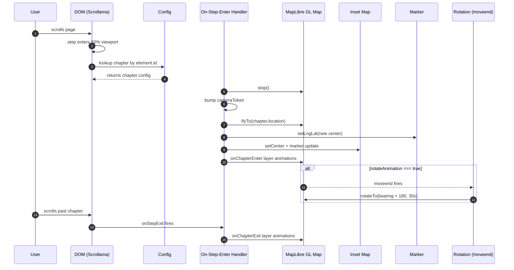

# GeoLibre Storymaps Architecture

./a-tour-of-five-cities.html

## Core Architecture — Data → DOM → Map → Scroll

1. **Config** (line 76-218): `config` object holds chapters, map style, animation settings, theme. Drives everything.

2. **DOM Build** (lines 246-363):
   - Header / footer from config title/subtitle/byline
   - `config.chapters.forEach()` → creates `.sm-card` per chapter inside `.step` containers
   - Cards are draggable/resizable, each placed left/center/right based on alignment
   - Nav sidebar with clickable chapter links
   - Start/end slides as full-height scroll targets

3. **Map** (lines 407-436):
   - Fixed-position MapLibre GL map under all content
   - Inset mini-map (bottom-left) shows overview view
   - Single marker tracks current location

## Scroll-Driven Transitions

4. **Scrollama** (lines 438, 506-550):

   ```text
   User scrolls → .step scrolls into 50% viewport
       → onStepEnter fires:
          - camera flyTo chapter.location (zoom, pitch, bearing)
          - marker moves to new center
          - inset map updates
          - onChapterEnter layer animation runs (if any)
          - optional continuous rotation starts via moveend callback
   ```

## Chapter Data (JSON)

The `a-tour-of-five-cities.json` file defines the story as a JSON document with global settings and an array of chapters. Each chapter is driven by two primary pieces of content: **image** and **description**, rendered together in a scrollable card on top of the map.

### Global Config

| Field | Description |
|---|---|
| `title` | Story title shown in the header |
| `subtitle` | Subtitle (e.g. "A scrollytelling map experience built with GeoLibre") |
| `byline` | Attribution line (e.g. "By GeoLibre") |
| `footer` | Footer text, supports HTML links |
| `theme` | `"dark"` or `"light"` — affects card and nav background |
| `showMarkers` | Whether to show a marker on the main map |
| `markerColor` | Hex color for the marker (default `#3fb1ce`) |
| `inset` | Whether to show an inset overview map |
| `insetPosition` | Corner position: `bottom-left`, `top-right`, etc. |
| `hideChapterNav` | Hide chapter sidebar on load |
| `startSlide` / `endSlide` | Intro/outro slide type (`none`, `blank`, `black`, `global`, `adjacent`) |

### Chapter Schema

Each entry in `config.chapters[]` describes one story step. The core content fields are:

- **`image`** — URL to an image (photo, illustration). Rendered full-width inside the card body using `` with `object-fit: cover`. This is the visual anchor for each chapter.
- **`description`** — HTML text displayed below the image. Supports `<br>`, `<br><br>`, links, and other inline markup. This is the narrative content that explains what the user is seeing on the map.

### Chapter Fields (full)

| Field | Type | Description |
|---|---|---|
| `id` | string | Unique identifier for DOM element lookup |
| `title` | string | Card title bar text |
| `image` | string (URL) | **Photo/illustration URL — rendered as `` in the card body** |
| `description` | string (HTML) | **Narrative text — displayed below the image, supports inline HTML** |
| `alignment` | `"left"` / `"right"` / `"center"` / `"full"` | Horizontal placement of the card (`lefty`, `righty`, `centered`, `fully`) |
| `hidden` | boolean | Hide this chapter from scroll |
| `location.center` | `[lng, lat]` | Map camera target coordinates |
| `location.zoom` | number | Zoom level (e.g. 10–11 for city view) |
| `location.pitch` | number | Camera pitch angle (0° = flat, up to 60°) |
| `location.bearing` | number | Camera rotation in degrees |
| `mapAnimation` | `"flyTo"` / `"easeTo"` | Transition animation type |
| `rotateAnimation` | boolean | Enable continuous 180° rotation after camera settles |
| `onChapterEnter` | array | Layer opacity rules applied when entering the chapter |
| `onChapterExit` | array | Layer opacity rules restored when exiting the chapter |

### How Image + Description Render

When Scrollama fires `onStepEnter` for a chapter, the card (already built from the config) becomes visually active. Inside `.sm-body`:

1. An `` element loads the **image** URL, styled at `max-height: 38vh` with `object-fit: cover`
2. A `<p>` element renders the **description** via `innerHTML`, supporting HTML formatting

The card itself is a draggable, resizable widget (`.sm-card`) with a title bar (`sm-bar`) and scrollable body — so long descriptions do not overflow the viewport.

Scrollytelling = **scroll position → camera state**. Chapter cards are just scroll-space padders; the `.step` padding-bottom (50vh) keeps each step visible long enough for the user to read while the map sits fixed below. No timeline, no manual page turns — scroll drives everything.

---

## Sequence Diagram


